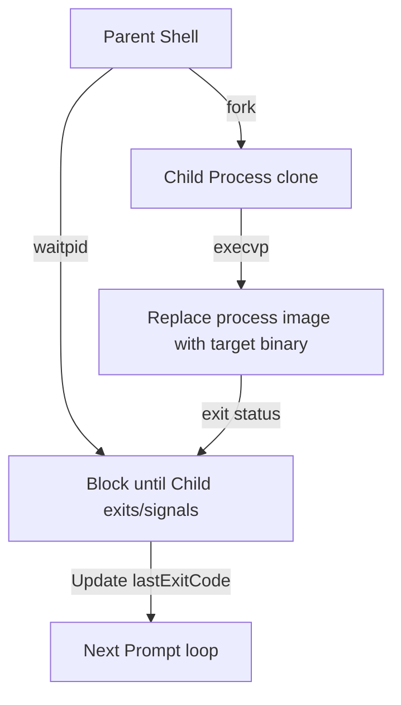

# AdvancedShell: Internal Execution Architecture

This documentation details the process management design used by AdvancedShell. It acts as an internal reference for repository maintainers and contributors.

---

## 1. Process Lifecycle Design

### Why avoid `std::system()`?
In high-level applications, `std::system()` is a quick way to run external commands. However, it operates by spawning a system shell (e.g., `/bin/sh -c "command"`) as a separate process, which then executes the command. 

For a custom shell:
1. **Inefficiency:** Every command requires spawning two processes (`sh` + the command) instead of one.
2. **Control Loss:** The shell loses direct control over the execution, signal forwarding, and fine-grained environment management.
3. **Builtin Isolation:** Commands like `cd` or `export` cannot alter the shell's active state because the working directories are modified inside child subshells instead of the parent shell process.

### The POSIX Lifecycle: `fork()`, `execvp()`, and `waitpid()`

We replaced `std::system()` with a native, low-level process model:



1. **`fork()`:** Clones the calling shell process. It returns `0` inside the child process and the child's `pid` inside the parent process.
2. **`execvp(const char* file, char* const argv[])`:**
   - **`p` suffix:** Searches for the executable file in the directories specified in the `PATH` environment variable.
   - **`v` suffix:** Takes arguments as an array of pointers.
   - On success, `execvp` does not return; it replaces the child's address space, stack, heap, and registers with the target binary.
3. **`waitpid(pid, &status, options)`:** Blocks the parent shell until the specific child process terminates or receives a signal, ensuring synchronous execution.

---

## 2. Argument Tokenization & Memory Safety

`execvp` requires arguments to be passed as a null-terminated array of non-const `char*` pointers (`char* const argv[]`).

### Tokenization Flow
We parse the command string using `std::istringstream` to safely extract words delimited by whitespace:
```cpp
std::vector<std::string> args;
std::string arg;
std::istringstream iss(command);
while (iss >> arg) {
    args.push_back(arg);
}
```

### Safely Constructing `argv` (No `const_cast` or malloc)
C++11 and onwards guarantees that `std::string` characters are stored contiguously in memory and are null-terminated.
Instead of doing dangerous `const_cast<char*>(s.c_str())` or allocating character buffers via `malloc()` / `strdup()`, we retrieve pointers directly to the internal character arrays of our vector-managed strings:
```cpp
std::vector<char*> argv;
for (auto& s : args) {
    argv.push_back(&s[0]); // Pointer to contiguous, null-terminated string buffer
}
argv.push_back(nullptr);   // Null-terminator required by POSIX
```
*Note: Because `args` is declared on the stack and stays in scope throughout the execution, the pointers inside `argv` remain fully valid until `execvp` replaces the process image.*

---

## 3. Exit Code and Signal Propagation

Standard shell behaviors mandate that we parse why a process ended and propagate the status accordingly:
- **Normal Exit:** Checked using `WIFEXITED(status)`. The exit status is extracted with `WEXITSTATUS(status)`.
- **Signaled Termination:** Checked using `WIFSIGNALED(status)`. If a process is terminated by an unhandled signal, the exit code is set to `128 + WTERMSIG(status)` (e.g., standard shell conventions for `Ctrl+C` termination).
