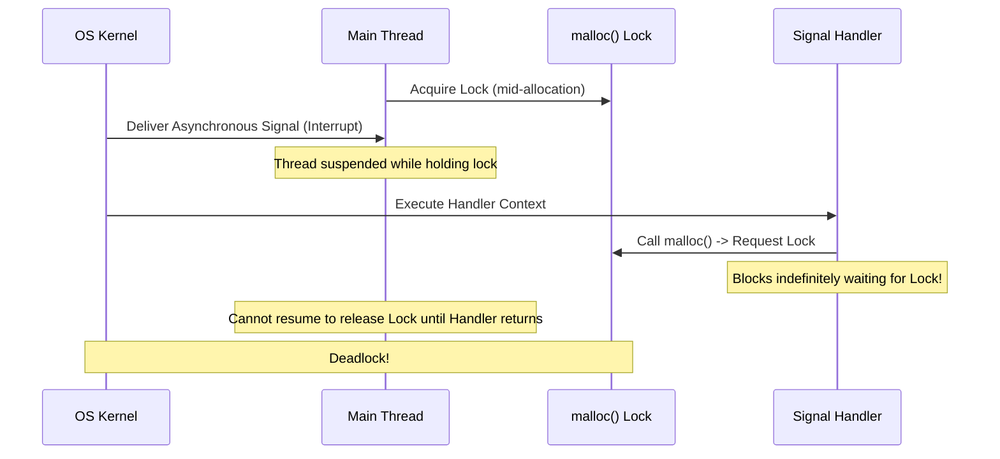
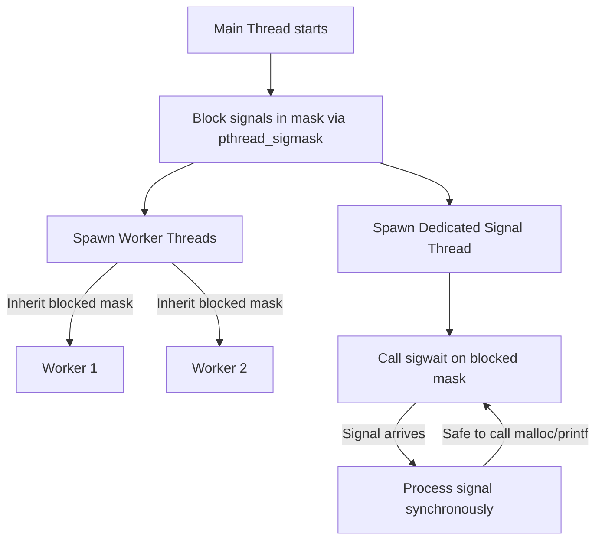

# Architectural & Systems Deep Dive: AdvancedShell Reference

This document provides a detailed technical analysis of low-level systems programming (POSIX), high-performance AI transfer learning & execution, and distributed system design. It connects these theoretical concepts to the architecture and implementation patterns found in the `AdvancedShell` codebase.

---

## 1. Low-Level POSIX Systems Programming & Architecture

### 1.1 The Signal Safety Nightmare
Asynchronous signals represent a fundamental challenge in POSIX systems because they interrupt the normal control flow of a thread at an arbitrary instruction boundary.

#### The Architectural Catastrophe: Non-Reentrancy and Deadlocks
If a thread is interrupted while executing a non-reentrant function (e.g., `malloc()` or `printf()`), and the registered signal handler attempts to invoke that same function, a self-deadlock or state corruption occurs.



1. **Mutex Self-Deadlock:**
   Standard implementations of `malloc()` use internal locks (such as mutexes) to protect the shared heap structure from concurrent access by multiple threads. If a thread is interrupted while holding the allocator's internal lock, and the signal handler calls `malloc()`, the handler will try to acquire that same lock. Because the interrupted thread cannot proceed until the signal handler exits, the lock is never released, resulting in an immediate deadlock.
   
2. **Standard I/O Buffer Corruption:**
   `printf()` utilizes a shared global stream buffer (`stdout`) and locks it during output formatting. Calling `printf()` inside a signal handler while the main execution thread is formatting output can corrupt standard output structures and trigger deadlocks on stdout locks.
   
3. **Heap Metadata Corruption:**
   If the allocator is interrupted during a pointer modification (e.g., updating the links of a doubly-linked free list) and the handler runs `malloc()`, the handler operates on a corrupted heap state. This leads to undefined behavior, including segmentation faults, double frees, or memory leaks.

#### Safely Handling Asynchronous Signals in a Multi-Threaded Daemon
To eliminate these race conditions, a multi-threaded daemon should follow a synchronous signal handling model:



1. **Signal Masking (Inheritance):**
   Before spawning any threads, the main thread blocks all asynchronous signals that the daemon intends to handle (e.g., `SIGINT`, `SIGTERM`, `SIGHUP`, `SIGCHLD`) using `pthread_sigmask()`:
   ```cpp
   sigset_t set;
   sigemptyset(&set);
   sigaddset(&set, SIGTERM);
   sigaddset(&set, SIGINT);
   pthread_sigmask(SIG_BLOCK, &set, nullptr);
   ```
   Since newly created threads inherit the signal mask of their parent, all worker threads spawned after this block will automatically ignore these signals, preventing them from being interrupted.

2. **Dedicated Signal Thread (`sigwait`):**
   A dedicated signal-handling thread is spawned to handle signals synchronously:
   ```cpp
   void* signal_handler_thread(void* arg) {
       sigset_t* set = static_cast<sigset_t*>(arg);
       int sig;
       while (true) {
           // Block until one of the signals in 'set' is pending
           int err = sigwait(set, &sig);
           if (err == 0) {
               // Handle the signal synchronously in a normal execution context.
               // It is fully safe to use malloc(), printf(), or any library call here.
               if (sig == SIGTERM || sig == SIGINT) {
                   shutdown_daemon();
                   break;
               }
           }
       }
       return nullptr;
   }
   ```
   Because the signal is caught synchronously via `sigwait()`, no thread stack is asynchronously interrupted, completely avoiding reentrancy violations.

---

### 1.2 Process Lifecycles & Zombie Starvation

#### The Kernel's Process Table and Zombies
When a child process terminates, the kernel releases its user-space memory, but retains its metadata entry in the system process table (specifically its PID, termination status, and resource usage statistics). This entry remains in the **Zombie** (`Z`) state until the parent process reaps it.

If a parent process continuously forks child workers but:
- Never calls `wait()` or `waitpid()`, and
- Explicitly ignores `SIGCHLD` (either by default or by leaving the signal unhandled without reaping),

the process table will slowly saturate. The kernel process table is a finite structure with a system-wide maximum capacity (governed by `/proc/sys/kernel/pid_max` on Linux). Once the maximum number of process descriptors is reached, no new processes can be spawned on the entire operating system, returning `EAGAIN` or `ENOMEM` to any process calling `fork()`. This results in **system-wide resource starvation**.

> [!NOTE]
> On modern POSIX systems, explicitly setting the disposition of `SIGCHLD` to `SIG_IGN` via `sigaction` or `signal` causes child processes to be automatically reaped by the kernel upon termination, preventing them from becoming zombies. However, relying on this behaves differently on legacy UNIX platforms and does not allow the parent to capture exit statuses.

#### Preventing Zombie Accumulation Non-Blockingly
To prevent zombie processes without blocking the parent shell's execution loop, the parent can handle the `SIGCHLD` signal asynchronously using a non-blocking `waitpid` loop:

```cpp
#include <sys/wait.h>
#include <signal.h>
#include <errno.h>

void sigchld_handler(int sig) {
    // Preserve errno to avoid corrupting the interrupted thread's state
    int saved_errno = errno;
    
    // WNOHANG prevents waitpid from blocking if no zombie children exist.
    // The loop is critical because SIGCHLD signals are not queued;
    // multiple children exiting simultaneously will only trigger one signal.
    while (waitpid(-1, nullptr, WNOHANG) > 0) {
        // Child reaped successfully
    }
    
    errno = saved_errno;
}

void setup_async_reaper() {
    struct sigaction sa;
    sa.sa_handler = sigchld_handler;
    sigemptyset(&sa.sa_mask);
    // Restart interrupted system calls automatically where possible
    sa.sa_flags = SA_RESTART | SA_NOCLDSTOP; 
    sigaction(SIGCHLD, &sa, nullptr);
}
```
*   `WNOHANG` ensures that the handler reaps all pending zombie children and returns immediately when no more exited children are found, preventing the parent thread from blocking.
*   `SA_NOCLDSTOP` prevents the handler from firing when children are stopped (e.g., via `SIGSTOP`) rather than terminated.

---

### 1.3 File Descriptor & Pipe Deadlocks

#### Why the OS Fails to Send EOF
A POSIX pipe is managed as an in-memory buffer with two file descriptors: a read end and a write end. The operating system sends an End-of-File (EOF) signal (causing a `read()` on the read end to return `0`) **only when the system-wide reference count of open file descriptors pointing to the write-end of that pipe reaches exactly zero**.

In a multi-stage pipeline (e.g., `cmd1 | cmd2 | cmd3`), the shell creates two pipes. If `cmd2` (the middle process) fails to close the write-end of the pipe that it was duplicated from (the pipe connecting `cmd1` to `cmd2`), `cmd2` retains an open write descriptor to its own input channel. 

Even if `cmd1` terminates and closes its write descriptor:
1. The kernel checks the write-end of the first pipe.
2. It finds that `cmd2` still holds an open file descriptor pointing to this write-end.
3. Therefore, the reference count remains $\ge 1$.
4. When `cmd2` reads from its stdin (which is mapped to the read end of the pipe), it blocks waiting for more input because the kernel assumes a writer (`cmd2` itself) might still write data.
5. The pipeline hangs indefinitely because `cmd2` is blocking on a read that will never receive EOF, and `cmd3` is blocking waiting for `cmd2` to produce output.

#### AdvancedShell Execution Loop Architecture
To mathematically prevent file descriptor leaks, [executor.cpp](file:///c:/Users/Srishti/OneDrive/Desktop/AdvancedShell/src/executor.cpp) implements a precise lifecycle cleanup.

When spawning a pipeline, [CommandExecutor::execute](file:///c:/Users/Srishti/OneDrive/Desktop/AdvancedShell/src/executor.cpp#L123) creates $2 \times (N - 1)$ pipe descriptors in the parent shell process (where $N$ is the number of stages):

```cpp
// From src/executor.cpp
size_t numStages = stages.size();
std::vector<pid_t> pids(numStages);
std::vector<int> pipeFds(2 * (numStages - 1));

for (size_t i = 0; i < numStages - 1; ++i) {
    if (pipe(&pipeFds[2 * i]) < 0) {
        perror("pipe failed");
        lastExitCode = 1;
        return lastExitCode;
    }
}
```

For each child process $i$, `executor.cpp` redirects the standard streams using `dup2` and immediately closes **all** raw pipe descriptors before calling `execvp`:

```cpp
// From src/executor.cpp: Child Process Stage i (lines 228-249)
if (i > 0) {
    if (dup2(pipeFds[2 * (i - 1)], STDIN_FILENO) < 0) {
        perror("dup2 stdin pipe failed");
        exit(1);
    }
}

if (i < numStages - 1) {
    if (dup2(pipeFds[2 * i + 1], STDOUT_FILENO) < 0) {
        perror("dup2 stdout pipe failed");
        exit(1);
    }
}

// CRITICAL: Close all raw pipe FDs in the child to prevent write-end leaks!
for (int fd : pipeFds) {
    close(fd);
}
```

Additionally, the parent shell process must also close its copies of the pipe descriptors to prevent leaking the write-ends:

```cpp
// From src/executor.cpp: Parent closes all pipe FDs (lines 331-334)
for (int fd : pipeFds) {
    close(fd);
}
```

This dual cleanup ensures that:
- Every child holds only the duplicated stream descriptors (`STDIN_FILENO` / `STDOUT_FILENO`).
- The parent process holds no open write-ends to the pipes.
- Once a stage finishes and exits, all write-ends of its outgoing pipe are automatically closed, propagating the EOF down the pipeline cleanly.

---

## 2. High-Performance AI Engineering & Transfer Learning

### 2.1 Feature Representation Decay in Transfer Learning

#### Catastrophic Forgetting in Transformers
When fine-tuning a pre-trained transformer model (e.g., Wav2Vec 2.0) across linguistically disparate datasets (e.g., English pre-training fine-tuned on German audio), the model suffers from **catastrophic forgetting**. 

In speech transformers, early layers encode general acoustic abstractions (formants, spectrogram boundaries, pitch) that are highly invariant across human languages. Deeper layers encode language-specific representations (phonemes, syntax, semantics). 

During standard backpropagation, gradient updates flow backwards from the output loss:
$$\nabla_{\theta} \mathcal{L}$$
Without architectural constraints, these updates propagate through all layers, modifying the early feature extractors to optimize for the target language's specific acoustic features. This collapses the general acoustic representation space, causing representation decay.

#### Mathematical Framework for Layer Aggregation and Temporal Pooling
To mitigate this decay, we extract representations from multiple intermediate layers and combine them using a parametric weighted pool.

```
Transformer Hidden States:
[Layer 1: H_1] ----\
[Layer 2: H_2] -----\
  ...                +--> Weighted Aggregation (alpha_l) --> [Aggregated H] --> Attention Pooling (a_t) --> [Pooled Vector z]
[Layer L: H_L] -----/
```

##### 1. Parametric Weighted Layer Aggregation
Instead of extracting features only from the final layer $H_L$, we construct a representation $H \in \mathbb{R}^{T \times D}$ by taking a weighted sum of all layer hidden states $H_l \in \mathbb{R}^{T \times D}$:
$$H = \sum_{l=1}^{L} \alpha_l H_l$$
The weights $\alpha_l$ are parameterized by real numbers $w_l$ and normalized via a softmax function to enforce $\sum_{l=1}^{L} \alpha_l = 1$:
$$\alpha_l = \frac{e^{w_l}}{\sum_{k=1}^{L} e^{w_k}}$$
To prevent gradient updates from corrupting early layers, we can apply **Layer-wise Learning Rate Decay (LLRD)**. The learning rate $\eta_l$ for layer $l$ is scaled by:
$$\eta_l = \eta \cdot d^{L - l}$$
where $\eta$ is the base learning rate and $d \in (0, 1)$ (typically $0.75$) is the decay factor. Consequently, early layers undergo minimal updates ($\eta_1 \ll \eta_L$), preserving the early acoustic abstractions.

##### 2. Attention-Based Temporal Pooling
To aggregate the dynamic sequence length $T$ into a static representation $z \in \mathbb{R}^D$, we apply a temporal self-attention mechanism rather than simple mean pooling. For each frame vector $h_t \in \mathbb{R}^D$ in $H$, we compute a query alignment score:
$$e_t = v^T \tanh(W h_t + b)$$
where $W \in \mathbb{R}^{D_a \times D}$ and $v \in \mathbb{R}^{D_a}$ are learnable projection parameters. The temporal attention weights $a_t$ are calculated as:
$$a_t = \frac{e^{e_t}}{\sum_{\tau=1}^{T} e^{e_\tau}}$$
The final pooled representation is the weighted average across time:
$$z = \sum_{t=1}^{T} a_t h_t$$
This preserves important acoustic segments while down-weighting silence and noise, maintaining feature abstraction.

---

### 2.2 The Runtime Optimization Tradeoff

#### The Mechanical Sympathy Conflict
High-performance execution of multi-dimensional vector computations (e.g., vector search, embedding inference) requires resolving a conflict between **throughput optimization** (maximizing resource utilization via batching) and **latency minimization** (executing requests immediately).

| Optimization Goal | Core Mechanics | Architectural Needs |
| :--- | :--- | :--- |
| **High Throughput** | SIMD Vectorization, Cache Line Contiguity (SoA), amortized syscall/thread overhead | Large, contiguous memory blocks processed in batches. |
| **Low Latency** | Instant response to individual requests, minimal queueing delay | Immediate, single-item execution on dedicated threads. |

Executing a single request immediately violates *mechanical sympathy* because it fails to saturate wide SIMD registers (e.g., AVX-512) and suffers from cache coldness (frequent memory fetches for single items).

#### Resolution: Dynamic Micro-Batching and Cache Pinning
We resolve this conflict with a three-pillar architecture:

```
Incoming Requests ──> [ Lock-Free Queue (MPSC Ring Buffer) ]
                             │
                             ▼  (Wait <= 200 microseconds / Batch size >= 32)
                      [ Dynamic Micro-Batcher ]
                             │
                             ▼  (Pack into contiguous aligned memory)
                      [ SIMD Executor (AVX-512 Core) ]
                             │
                             ▼
                      [ Thread Core Affinity (CPU Pinning) ]
```

##### 1. Lock-Free Queueing & Dynamic Micro-Batching
Instead of executing requests immediately, incoming queries are pushed into a lock-free Multi-Producer Single-Consumer (MPSC) queue.
A background worker thread implements a polling loop with a dual-trigger constraint:
*   **Trigger A:** Batch size reaches $B_{max}$ (e.g., 32 vectors).
*   **Trigger B:** Timeout $T_{max}$ expires (e.g., $200\,\mu\text{s}$).

Once triggered, the worker thread pops the items and processes them. The $200\,\mu\text{s}$ timeout guarantees that the worst-case queuing latency remains well within the sub-millisecond threshold, while high-concurrency periods automatically trigger batching to maximize throughput.

##### 2. Memory Alignment and Structure of Arrays (SoA)
To maximize cache line utilization (64 bytes on modern CPUs) and enable SIMD vectorization, we layout vectors in memory using a Struct-of-Arrays (SoA) format rather than an Array-of-Structs (AoS):

*   **AoS (Bad for SIMD):** `[x1, y1, z1, x2, y2, z2, ...]` requires gather instructions to load single dimensions.
*   **SoA (Good for SIMD):** `[x1, x2, x3, ...]`, `[y1, y2, y3, ...]`.

We allocate memory aligned to 64-byte boundaries:
```cpp
void* ptr = nullptr;
int err = posix_memalign(&ptr, 64, batch_size * vector_dimension * sizeof(float));
```
This alignment matches the 512-bit register width of AVX-512, permitting aligned vector loads (`_mm512_load_ps`) which execute faster than unaligned loads.

##### 3. CPU Core Pinning (Affinity)
To prevent the operating system from scheduling thread migrations across CPU cores (which flushes L1/L2 caches and introduces cross-socket NUMA bus overhead), we bind worker threads to specific physical CPU cores using thread affinity:
```cpp
#include <pthread.h>

void pin_thread_to_core(int core_id) {
    cpu_set_t cpuset;
    CPU_ZERO(&cpuset);
    CPU_SET(core_id, &cpuset);
    pthread_setaffinity_np(pthread_self(), sizeof(cpu_set_t), &cpuset);
}
```

---

## 3. System Design, Failures & Distributed Architecture

### 3.1 The Technical Debt Reckoning

#### Surgical Remediation of Unvalidated Token Streams
When inheriting an execution engine that blindly executes naive token streams without validation, we can inject structural design patterns to isolate the legacy component and enforce safety without performing a risky rewrite of the core logic.

```
Unvalidated Token Stream ──> [ Adapter ] ──> [ Chain of Responsibility ] ──> [ Legacy Decorator ] ──> Legacy Engine
```

##### 1. The Adapter Pattern: Token Formalization
We wrap the naive string-based input in an Adapter that translates string tokens into a strongly-typed `CommandSpecification` object. This layer enforces type safety early.

##### 2. The Chain of Responsibility Pattern: Stepwise Validation
We route the `CommandSpecification` through a pipeline of validation handlers. Each handler inherits from a common interface and validates a single concern:

```cpp
class TokenValidator {
protected:
    std::shared_ptr<TokenValidator> nextValidator;
public:
    void setNext(std::shared_ptr<TokenValidator> next) { nextValidator = next; }
    virtual bool validate(const CommandSpecification& spec) = 0;
};

// Concrete implementation checking for shell injection characters
class ShellInjectionValidator : public TokenValidator {
public:
    bool validate(const CommandSpecification& spec) override {
        for (const auto& arg : spec.getArguments()) {
            if (arg.find(';') != std::string::npos || arg.find('&') != std::string::npos) {
                std::cerr << "Validation Error: Unsafe character detected.\n";
                return false;
            }
        }
        return nextValidator ? nextValidator->validate(spec) : true;
    }
};
```
If any validator in the chain fails, execution is aborted before reaching the environment.

##### 3. The Decorator Pattern: Interception & Sanitization
We wrap the legacy execution engine in a decorator class that implements the same interface. The decorator intercepts execution requests, routes them through our `TokenValidator` chain, and forwards them to the legacy engine only if validation succeeds:

```cpp
class LegacyExecutorDecorator : public Executor {
private:
    std::unique_ptr<Executor> legacyExecutor;
    std::shared_ptr<TokenValidator> validationChain;
public:
    LegacyExecutorDecorator(std::unique_ptr<Executor> legacy) : legacyExecutor(std::move(legacy)) {
        // Initialize and link validators
        auto inj = std::make_shared<ShellInjectionValidator>();
        validationChain = inj;
    }

    int execute(const std::string& command) override {
        CommandSpecification spec = parseAndAdapt(command);
        if (!validationChain->validate(spec)) {
            return 1; // Rejected safely
        }
        return legacyExecutor->execute(command); // Forwarded to legacy engine
    }
};
```
This architecture mirrors the token-handling improvements in `AdvancedShell`, which parses standard input into structured [CommandStage](file:///c:/Users/Srishti/OneDrive/Desktop/AdvancedShell/src/executor.cpp#L15) structs, isolating redirection paths and built-ins prior to child execution.

---

### 3.2 Microservices State Corruption

#### Distributed Transactions during Network Partitions
During a network partition, the network splits into disconnected components, preventing microservices from completing transactions in sync. To manage consistency, we must choose between strong consistency (via locking) and eventual consistency (via sagas).

```
Network Partition:
[ Service A ] ── x ── [ Service B ]
```

#### Comparison: Two-Phase Locking (2PL) vs. Saga Orchestration

| Dimension | Two-Phase Locking (2PL) | Saga Orchestration |
| :--- | :--- | :--- |
| **Consistency Model** | Strong Consistency (ACID) | Eventual Consistency (BASE) |
| **Locking Strategy** | Pessimistic: Locks resources across all services during phase 1, releases in phase 2. | Optimistic: Local transactions commit immediately; compensating steps handle rollbacks. |
| **Scalability** | Low: Locks are held for the duration of the network round-trip. | High: No distributed locks; services are decoupled. |
| **Failure Mode on Partition** | Deadlock storms, resource starvation (locks held indefinitely). | Lack of isolation (dirty reads, lost updates). |

##### Two-Phase Locking (2PL) Failure Modes
1.  **Distributed Deadlock Storms:**
    If Service A locks Resource 1 and requests Resource 2, while Service B locks Resource 2 and requests Resource 1 during a partition, a distributed deadlock occurs.
2.  **Coordinator Blocking:**
    If the coordinator node crashes or becomes isolated during the commit phase, all participating services are left in an uncertain state, holding locks indefinitely. This blocks other incoming operations, starving the system of database connections.

##### Saga Orchestration Failure Modes
Instead of locking, a Saga executes a chain of local transactions ($T_1, T_2, \dots, T_n$). If step $T_i$ fails, the Saga Orchestrator triggers compensating transactions ($C_{i-1}, \dots, C_1$) in reverse order to roll back changes.

```
Normal Flow:       T_1 (Debit Wallet) ──> T_2 (Reserve Stock) ──> T_3 (Confirm Order)
Failure at T_3:    T_1 (Debit Wallet) ──> T_2 (Reserve Stock) ──> T_3 (FAILED)
                                                │
                                                ▼  (Trigger Compensations)
                                          C_2 (Release Stock) <── C_1 (Refund Wallet)
```

1.  **Dirty Reads (Lack of Isolation):**
    Because local transactions commit immediately, Service B can read the changes made by transaction $T_1$ before the entire Saga finishes. If $T_2$ subsequently fails, and $C_1$ rolls back $T_1$, Service B has acted on dirty data that is now invalid.
2.  **Lost Updates:**
    If transaction $T_1$ updates a value, and a parallel Saga updates the same value, a compensating transaction $C_1$ executing later may overwrite the parallel update, losing that state change.
3.  **Orchestrator Partition State Split:**
    If the central orchestrator is partitioned from the target services, it may fail to send compensating transactions, leaving the system in a partially committed, inconsistent state.

#### Architectural Mitigation for Sagas
To safely implement Sagas under partitions, you must apply the following structural patterns:
*   **Idempotence:** Every microservice API must expose idempotent endpoints using unique transaction IDs. If a network retry occurs, the service recognizes the duplicate ID and returns the cached result instead of executing the operation again.
*   **Transactional Outbox Pattern:** Services should write domain events to an `Outbox` table in the same database transaction as the local state update. A reliable message relay polls the outbox and publishes the messages to a broker (e.g., Kafka). This guarantees "at-least-once" delivery of events even during network interruptions.
*   **Semantic Locking:** Introduce a "Pending" state (e.g., `ORDER_PENDING` instead of `ORDER_CONFIRMED`) to visually signal that the transaction is not final, preventing dirty reads from impacting external business decisions.
